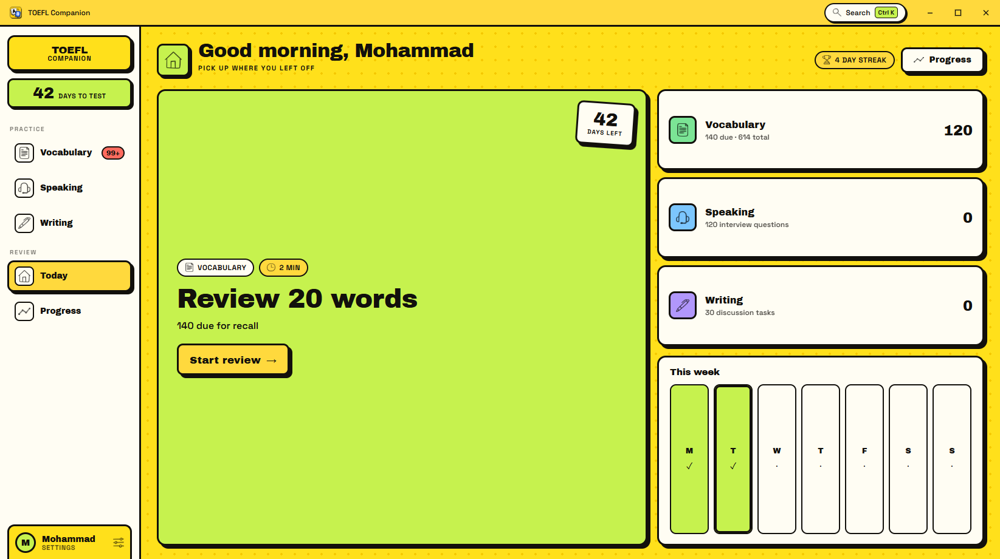
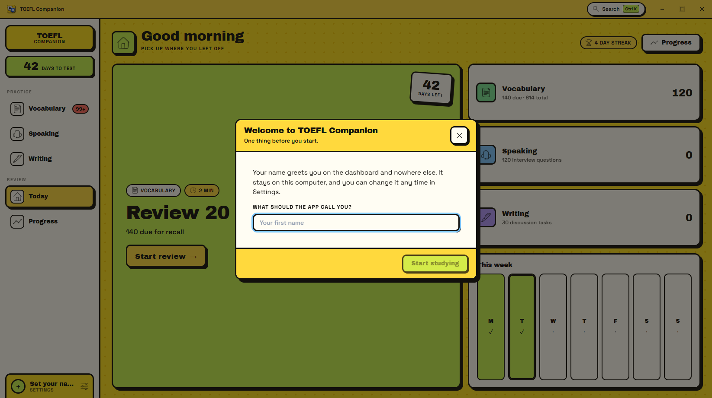
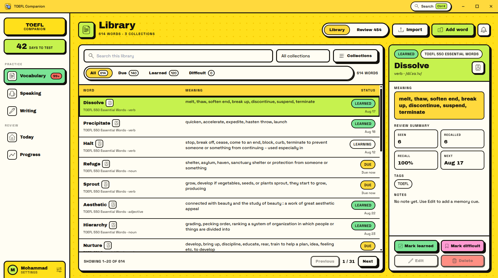
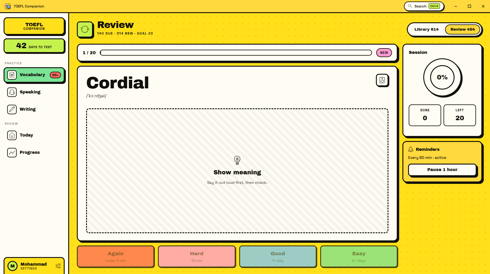
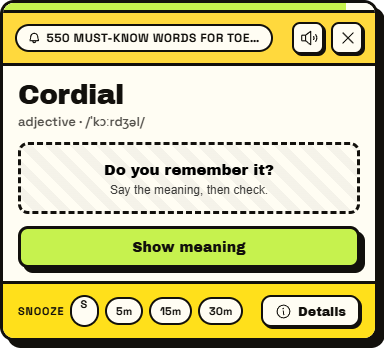
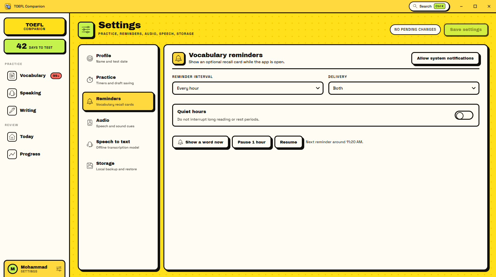
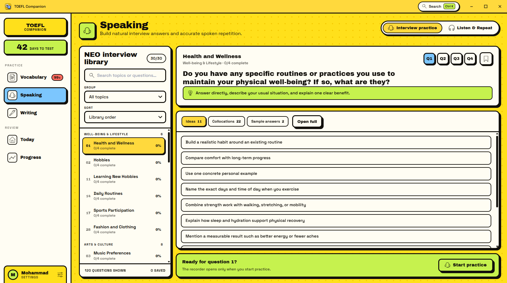
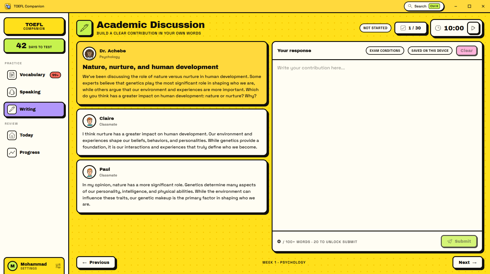
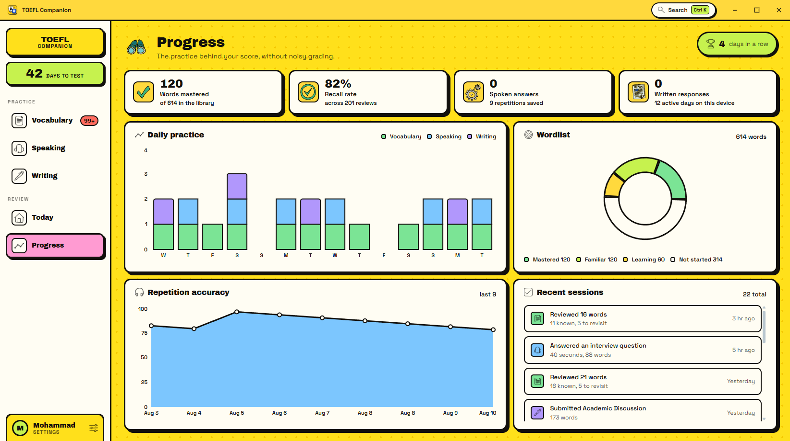
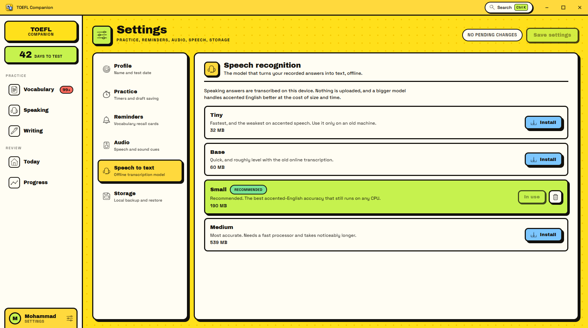

# TOEFL Companion

A Windows desktop app for preparing for the TOEFL: vocabulary you actually
remember, speaking answers you can hear back, and writing tasks with a timer.

Everything runs on your own machine. There is no account, no server, and no
network call in normal use — including the speech-to-text, which runs offline on
your CPU. The only time the app reaches the internet is when you choose to
download a transcription model.



---

## Install

Download `TOEFL-Companion-1.0.0-x64-setup.exe` from the
[latest release](https://github.com/cyanologyst/TOEFL-Companion/releases/latest)
and run it. It installs for the current user only, so it needs no administrator
rights, and lands in `%LOCALAPPDATA%\TOEFL Companion`.

There is also a portable `.exe` in the same release if you would rather not
install anything — it is the same app, just not registered with Windows.

**Windows will warn you.** The installer is not code-signed, so SmartScreen
shows "Windows protected your PC" and hides the Run button behind **More info →
Run anyway**. That warning means the publisher is unverified, not that anything
is wrong with the file; signing requires a purchased certificate. Verify the
download against `SHA256SUMS.txt` in the release if you want to be sure:

```powershell
Get-FileHash .\TOEFL-Companion-1.0.0-x64-setup.exe -Algorithm SHA256
```

Requires Windows 10 or 11 with the WebView2 runtime, which is already present on
any up-to-date Windows install.

On first launch the app asks what to call you, and nothing else.



---

## What it does

### Vocabulary — 614 words, and the ones you keep forgetting

Two built-in libraries (550 TOEFL words, 64 NEO words) plus anything you add.
Search, filter by due/learned/difficult, page through 20 at a time, and open any
word for its meaning, pronunciation, collocations, example, notes, and review
history.



Review is recall-first: the word appears alone, you say the meaning out loud,
then reveal and grade yourself. Grading feeds a spaced-repetition schedule, so
words you find hard come back sooner.



You can import and export collections as JSON, and build your own collections
alongside the built-in ones.

### Reminders that leave the app alone

A word can surface as a small window in the corner of your screen while you work
— not a card buried inside the app you would have to open to see.



It asks before it tells: term first, meaning on request, then Known / Later /
Forgot. It only draws from the collections you have switched on, holds off while
you are typing or recording, and respects an interval, quiet hours, snooze, and
pause.



### Speaking — 120 interview questions, transcribed offline

All 30 NEO topic sets, grouped and searchable, each with four questions, ideas,
collocations, and two sample answers. Record a 40-second answer, play it back,
and read what you actually said.



Listen & Repeat is a separate mode: hear a prompt, repeat it, and see your
version compared word by word against the expected transcript.

### Writing — 30 Academic Discussion tasks

A professor's question and two student responses, a countdown, a live word
count, autosave, and revision history for every task.



The rubric panel is a shell — it lays out the criteria but does not score you.
Nothing in the app pretends to grade your writing.

### Progress

What you have actually done: mastery split, recall rate, daily practice, and the
last sessions. No projected scores.



---

## Speech to text runs on your machine

Speaking answers are transcribed by [whisper.cpp](https://github.com/ggerganov/whisper.cpp)
running locally on your CPU. Your voice never leaves the computer.

Pick a model once from **Settings → Speech to text**. Larger models handle
accented English better and take longer:

| Model  | Size   | Notes                                                    |
| ------ | ------ | -------------------------------------------------------- |
| Tiny   | 32 MB  | Fastest, weakest on accents. Only for an old machine.     |
| Base   | 60 MB  | Roughly level with typical browser transcription.         |
| Small  | 190 MB | **Recommended.** Best accented-English accuracy on a CPU. |
| Medium | 539 MB | Most accurate, needs a fast processor.                    |



Downloading a model is the one action that uses the network. Downloads resume if
interrupted and are size-checked before use. Recording works without a model —
the attempt is just saved without a transcript, and the recorder says so.

---

## Your data

Everything lives on your machine: study progress and settings in the app's local
storage, recorded audio in IndexedDB. **Settings → Storage** exports the whole
lot to a single JSON file and restores it again. Audio recordings stay on the
device that made them and are not part of a backup.

None of it sits in the install folder, so it survives an uninstall:

```text
%LOCALAPPDATA%\com.toeflcompanion.app\   study data, recordings, logs
%APPDATA%\com.toeflcompanion.app\        downloaded speech models, window size
```

Delete those two folders to remove every trace.

---

## Build from source

Prerequisites: Node.js 20+, Rust 1.85+, and the Tauri 2 Windows prerequisites
(WebView2 and the Microsoft C++ build tools).

```powershell
npm install
npm run desktop:dev
```

To build the installer:

```powershell
npm run desktop:build
```

The bundle is written to `~/.toefl-companion-build/release/bundle/nsis/`.
`scripts/tauri.mjs` moves the Cargo target directory there whenever the checkout
path is longer than 90 characters, because the native whisper.cpp build hits the
Windows `MAX_PATH` limit otherwise and reports it as a confusing C compiler
error. [docs/RELEASE.md](docs/RELEASE.md) has the full release procedure,
including what code signing would take.

To work on the interface alone, without the Rust shell:

```powershell
npm run dev
```

### Checks

```powershell
npm run quality
```

Formatting, linting, both TypeScript projects, and 107 unit tests. The Rust side
has its own:

```powershell
cd src-tauri
cargo fmt --check
cargo clippy -- -D warnings
cargo test
```

---

## How it is put together

| Layer     | Choice                                                          |
| --------- | --------------------------------------------------------------- |
| Shell     | Tauri 2 — a frameless window with custom title bar and controls  |
| Interface | React 19 + TypeScript, Vite                                     |
| Speech    | whisper.cpp via `whisper-rs`, CPU only, quantized GGML models    |
| Storage   | `localStorage` for study data, IndexedDB for audio               |
| Style     | A neo-brutalist system in `src/brutal.css` — hard 3px outlines, unblurred offset shadows, flat colour |

More detail in [docs/ARCHITECTURE.md](docs/ARCHITECTURE.md),
[docs/DATA_FORMATS.md](docs/DATA_FORMATS.md), and
[docs/DESIGN.md](docs/DESIGN.md) — the last covers the visual system, the two
layout rules the app is held to, and how the interface is verified by
measurement rather than by eye.

Content libraries are editable JSON in `src/data/`:

- `toefl-data.json` — 30 interview sets, 120 questions
- `academic-discussions.json` — 30 writing tasks
- `listen-repeat.json` — repeat prompts and their audio manifest
- `toefl-550.wordlist.json`, `toefl-neo-1-10.wordlist.json` — vocabulary

---

## Known limits

- **Writing is not graded.** The rubric panel is a layout, not an evaluator.
- **Listen & Repeat uses synthesised speech** for its starter prompts until real
  recordings are dropped into the audio manifest.
- **No auto-update.** A new version means downloading and running the installer
  again.
- **Windows only.** The shell is cross-platform in principle, but nothing else
  has been built or tested.
- **The writing tasks came from OCR** and were checked structurally rather than
  proofread line by line against the source images.

---

## About the content

The bundled word lists, interview questions, and writing tasks were assembled
from TOEFL study material for personal use. If you intend to redistribute this
app or its data, check that you have the right to redistribute that material —
the code being open does not make the content free to republish.

Interface icons are from [Icons8](https://icons8.com), whose free tier requires
attribution.

## Licence

No licence has been granted, so all rights are reserved. If you want others to
be able to use, modify, or redistribute this, add a `LICENSE` file saying so.
